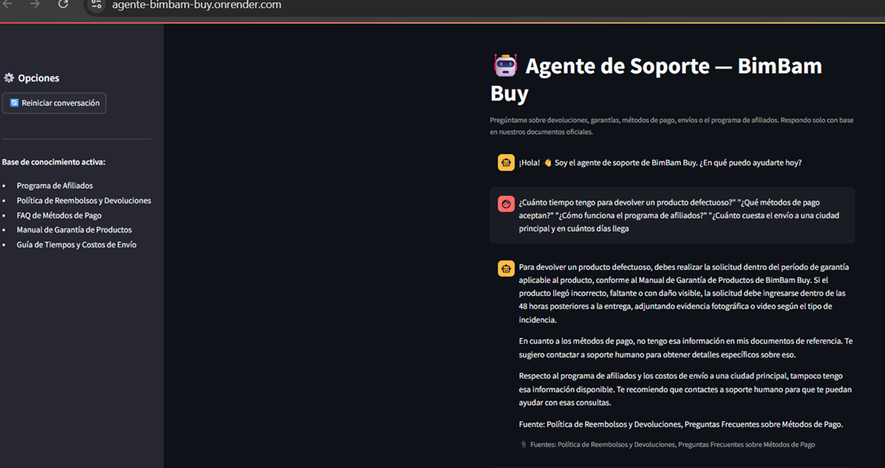
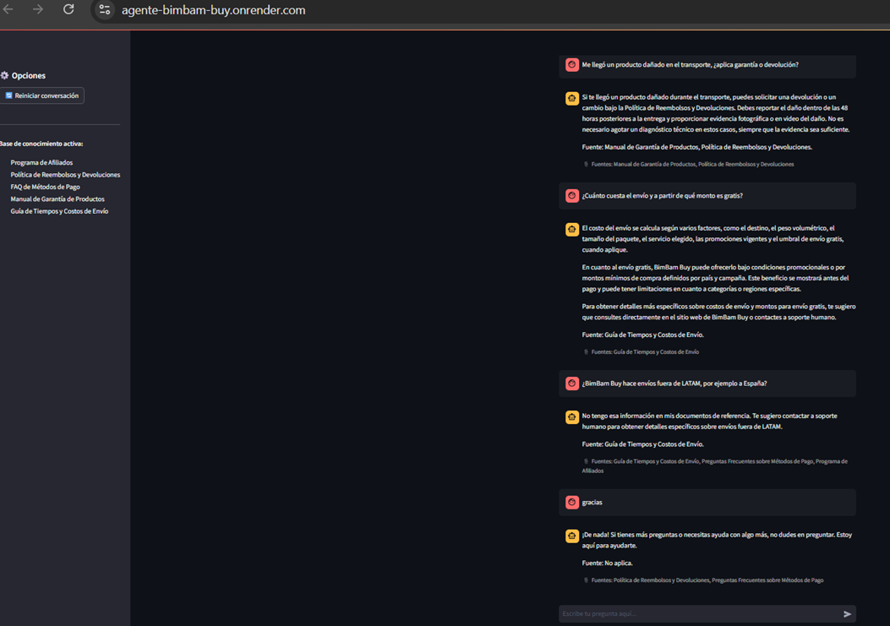

# 🤖 Agente IA de Soporte — BimBam Buy

Agente conversacional de atención al cliente basado en **RAG (Retrieval-Augmented
Generation)** que responde preguntas de soporte usando exclusivamente la base de
conocimiento interna de la empresa ficticia **BimBam Buy** (challenge estilo
Alura/ONE — *Construye tu Agente Inteligente*), construido con **Python +
LangChain**, expuesto como aplicación web con **Streamlit** y desplegado en
**Render**.

🔗 **Demo desplegada:** `<https://agente-bimbam-buy.onrender.com/>`

📄 Para el detalle completo del challenge y su arquitectura conceptual ver
[`GUIA_CHALLENGE_ALURA_AGENTE.md`](./GUIA_CHALLENGE_ALURA_AGENTE.md).

---

## Índice

- [🤖 Agente IA de Soporte — BimBam Buy](#-agente-ia-de-soporte--bimbam-buy)
  - [Índice](#índice)
  - [Descripción general](#descripción-general)
    - [Fuente de conocimiento](#fuente-de-conocimiento)
  - [Arquitectura de la solución](#arquitectura-de-la-solución)
  - [Decisiones de diseño clave](#decisiones-de-diseño-clave)
  - [Tecnologías y herramientas](#tecnologías-y-herramientas)
  - [Estructura del repositorio](#estructura-del-repositorio)
  - [Cómo ejecutar el proyecto localmente](#cómo-ejecutar-el-proyecto-localmente)
    - [Requisitos previos](#requisitos-previos)
    - [Pasos](#pasos)
  - [Cómo desplegar en Render](#cómo-desplegar-en-render)
    - [Opción A — Usando el Blueprint (`render.yaml`), recomendada](#opción-a--usando-el-blueprint-renderyaml-recomendada)
    - [Opción B — Configuración manual desde el Dashboard](#opción-b--configuración-manual-desde-el-dashboard)
  - [Base de conocimiento (BimBam Buy)](#base-de-conocimiento-bimbam-buy)
  - [Ejemplos de preguntas y respuestas](#ejemplos-de-preguntas-y-respuestas)
    - [Capturas de la interacción con el agente](#capturas-de-la-interacción-con-el-agente)
  - [Pruebas](#pruebas)
  - [Licencia y uso](#licencia-y-uso)

---

## Descripción general

El agente responde preguntas de clientes sobre devoluciones, garantías,
métodos de pago, envíos y el programa de afiliados, combinando una cadena
**RAG** (búsqueda semántica sobre 5 documentos oficiales indexados con
**FAISS**) con memoria conversacional de corto plazo (últimos turnos del
chat). Si la pregunta no puede responderse con la base de conocimiento
disponible, el agente lo indica explícitamente en vez de inventar una
respuesta, y siempre cita el documento fuente utilizado.

Ofrece dos interfaces: una web de chat con **Streamlit** (`app_streamlit.py`)
y un modo de consola (`main_cli.py`) para uso local rápido.

### Fuente de conocimiento

| Fuente | Tipo de consulta | Mecanismo |
|---|---|---|
| Programa de Afiliados, Política de Reembolsos y Devoluciones, FAQ de Métodos de Pago, Manual de Garantía, Guía de Envíos | Preguntas abiertas de soporte al cliente | RAG (búsqueda semántica con FAISS + embeddings) |

---

## Arquitectura de la solución

```
┌─────────────────────┐      1. Pregunta del usuario
│  Interfaz de Chat    │ ───────────────────────────────┐
│  (Streamlit)         │                                 │
└─────────────────────┘                                 ▼
        ▲                                     ┌───────────────────────┐
        │ 4. Respuesta + fuentes citadas       │  app_streamlit.py       │
        └────────────────────────────────────  │  (interfaz + sesión)    │
                                                └─────────┬───────────────┘
                                                          │
                                        2. Retriever busca│
                                        los fragmentos más▼
                                        relevantes  ┌───────────────────────────┐
                                                     │  AgenteBimBamBuy            │
                                                     │  (src/agent.py)             │
                                                     │  RAG + memoria conversac.   │
                                                     └──────────┬──────────────────┘
                                                                ▼
                                                  ┌───────────────────────────┐
                                                  │ Retriever FAISS              │
                                                  │ (src/vectorstore.py)         │
                                                  │ Embeddings: OpenAI o local    │
                                                  └─────────────┬─────────────────┘
                                                                ▼
                                                  ┌───────────────────────────┐
                                                  │ data/base_conocimiento/*.txt │
                                                  │ (5 documentos de soporte)     │
                                                  └───────────────────────────┘
                                                                │
                                                    3. El LLM (OpenAI o
                                                    Gemini) redacta la
                                                    respuesta final citando
                                                    el/los documento(s) usado(s)
```

---

## Decisiones de diseño clave

- **Embeddings del RAG intercambiables, con OpenAI como valor por defecto**
  (`EMBEDDINGS_PROVIDER=openai` en `src/config.py`). El proyecto original
  usaba únicamente `sentence-transformers` (ejecutado localmente con
  `torch`), lo que implica instalar cientos de MB de dependencias y cargar
  un modelo pesado en memoria al arrancar. Para un despliegue liviano y
  confiable en el plan gratuito de Render (memoria y tiempo de build
  limitados), este proyecto usa por defecto `OpenAIEmbeddings`
  (`text-embedding-3-small`). Si prefieres embeddings 100% locales y
  gratuitos para uso personal, puedes volver a `EMBEDDINGS_PROVIDER=local`
  instalando adicionalmente `requirements-local-embeddings.txt` (ver
  sección de instalación).
- **El índice FAISS se construye durante el *build* de Render**, no en cada
  arranque del servidor. El `buildCommand` del `render.yaml` corre
  `python -m src.ingest` después de instalar dependencias, así el índice ya
  está listo en disco cuando arranca Streamlit.
- **Proveedor del LLM de chat intercambiable**: `src/llm.py` soporta
  `LLM_PROVIDER=openai` (por defecto) o `LLM_PROVIDER=gemini`, sin tocar el
  resto del código.
- **Interfaz web con Streamlit en vez de un servidor Flask/Gunicorn**: por
  eso el `startCommand` en `render.yaml` invoca directamente
  `streamlit run` (Streamlit no se sirve con Gunicorn) y el
  `healthCheckPath` usa el endpoint propio de Streamlit
  (`/_stcore/health`) en lugar de una ruta personalizada.
- **Caché de recursos de Streamlit (`@st.cache_resource`)**: el agente y su
  índice FAISS se cargan una sola vez por proceso, no en cada mensaje del
  chat, para evitar reconstruir el retriever en cada pregunta.
- **Memoria conversacional acotada**: `AgenteBimBamBuy` guarda el historial
  completo de la sesión en memoria del proceso, pero solo envía al LLM los
  últimos 3 turnos (6 mensajes) para mantener el prompt corto y económico.

---

## Tecnologías y herramientas

- **Python 3.11**
- **Streamlit** — interfaz de chat web y servidor de la aplicación
- **LangChain** (`langchain`, `langchain-community`, `langchain-openai`,
  `langchain-google-genai`, `langchain-text-splitters`) — orquestación RAG
- **FAISS** (`faiss-cpu`) — índice vectorial para la búsqueda semántica
- **OpenAI API** — modelo de chat (`gpt-4o-mini` por defecto) y embeddings
  (`text-embedding-3-small`) por defecto
- **Google Gemini API** — alternativa opcional para el modelo de chat
- **sentence-transformers** (opcional) — embeddings 100% locales y
  gratuitos, solo si `EMBEDDINGS_PROVIDER=local`
- **Render** — plataforma de despliegue (Web Service)
- **pytest** — pruebas automatizadas del pipeline RAG

---

## Estructura del repositorio

```
agente-ia-bimbam-buy/
├── app_streamlit.py                  # Interfaz de chat web (Streamlit)
├── main_cli.py                       # Chat por terminal (uso local, opcional)
├── src/
│   ├── config.py                     # Configuración central (.env, rutas, modelos)
│   ├── llm.py                        # Fábrica de LLM (OpenAI/Gemini) y embeddings (OpenAI/local)
│   ├── ingest.py                     # Construye el índice FAISS
│   ├── vectorstore.py                # Carga/genera el índice FAISS
│   ├── prompts.py                    # Prompts del sistema y de RAG
│   └── agent.py                      # Cadena RAG + memoria conversacional
├── data/
│   └── base_conocimiento/            # 5 documentos fuente (base del RAG)
├── vectorstore/                      # Índice FAISS (se genera en el build de Render)
├── docs/                             # Capturas de pantalla (despliegue y pruebas)
│   ├── screenshot-deploy.png
│   ├── interaccion-1.png
│   └── interaccion-2.png
├── tests/
│   └── test_agent.py                 # Pruebas del pipeline (ingesta y retriever)
├── requirements.txt                  # Dependencias de producción (livianas)
├── requirements-local-embeddings.txt # Dependencias OPCIONALES (embeddings locales)
├── render.yaml                       # Blueprint de despliegue en Render
├── .env.example
├── .gitignore
├── LICENSE
├── GUIA_CHALLENGE_ALURA_AGENTE.md     # Guía completa del challenge
└── README.md
```

---

## Cómo ejecutar el proyecto localmente

### Requisitos previos

- Python 3.10+
- **Visual Studio Code** con la extensión de Python (recomendado para
  seguir estos pasos desde la terminal integrada)
- Una API key de OpenAI ([platform.openai.com/api-keys](https://platform.openai.com/api-keys)) —
  requerida por defecto (`EMBEDDINGS_PROVIDER=openai`) y también si usas
  `LLM_PROVIDER=openai`
- (Opcional) Una API key de Google Gemini si quieres usar Gemini como modelo de chat
- (Opcional) Si prefieres embeddings 100% locales y gratuitos, no necesitas
  ninguna clave de OpenAI para los embeddings, pero sí instalar un paquete
  adicional (ver paso 3)

### Pasos

```bash
# 1. Clonar el repositorio y abrirlo en VS Code
git clone https://github.com/<tu-usuario>/agente-ia-bimbam-buy.git
cd agente-ia-bimbam-buy
code .

# 2. Crear y activar un entorno virtual (terminal integrada de VS Code)
python -m venv .venv
source .venv/bin/activate        # En Windows (PowerShell): .venv\Scripts\Activate.ps1

# 3. Instalar dependencias
pip install -r requirements.txt
# Opcional, solo si quieres EMBEDDINGS_PROVIDER=local:
pip install -r requirements-local-embeddings.txt

# 4. Configurar variables de entorno
cp .env.example .env
# Edita .env y coloca tu OPENAI_API_KEY (y GOOGLE_API_KEY si aplica)

# 5. Construir el índice vectorial (una sola vez, o cuando cambien los documentos)
python -m src.ingest

# 6. Ejecutar el chat por consola...
python main_cli.py

# ...o la interfaz web
streamlit run app_streamlit.py
```

La interfaz web quedará disponible en `http://localhost:8501`.

> 💡 En VS Code, recuerda seleccionar el intérprete de Python del entorno
> virtual (`.venv`) desde la paleta de comandos (`Ctrl+Shift+P` →
> *Python: Select Interpreter*) para que el linter y el debugger usen las
> dependencias instaladas.

---

## Cómo desplegar en Render

### Opción A — Usando el Blueprint (`render.yaml`), recomendada

1. Sube el repositorio a GitHub (público o privado).
2. En el [Dashboard de Render](https://dashboard.render.com/), haz clic en
   **New +** → **Blueprint**.
3. Conecta tu repositorio de GitHub. Render detectará automáticamente
   `render.yaml`.
4. Completa las variables de entorno marcadas como secretas:
   - `OPENAI_API_KEY` → tu clave real (`sk-...`), **obligatoria siempre**
     mientras `EMBEDDINGS_PROVIDER=openai` (el valor por defecto)
   - `GOOGLE_API_KEY` → déjala vacía si no vas a usar Gemini
5. Haz clic en **Apply**. Render va a:
   - Instalar las dependencias (`pip install -r requirements.txt`)
   - Construir el índice FAISS (`python -m src.ingest`), lo cual hace
     llamadas reales (y económicas) a la API de embeddings de OpenAI
   - Iniciar Streamlit con `streamlit run app_streamlit.py`
6. Cuando el estado sea **Live**, visita la URL pública que Render asigna y
   prueba el chat.

> ⚠️ **Importante:** como el `buildCommand` ejecuta `python -m src.ingest`,
> la variable `OPENAI_API_KEY` debe estar configurada en Render **antes**
> de que corra el build.

### Opción B — Configuración manual desde el Dashboard

1. **New +** → **Web Service** → conecta el repositorio.
2. Configura:
   - **Runtime:** Python 3
   - **Build Command:** `pip install -r requirements.txt && python -m src.ingest`
   - **Start Command:**
     `streamlit run app_streamlit.py --server.port $PORT --server.address 0.0.0.0 --server.headless true`
3. En la sección **Environment**, agrega como mínimo:
   - `OPENAI_API_KEY` → tu clave real
   - `LLM_PROVIDER` → `openai`
   - `EMBEDDINGS_PROVIDER` → `openai`
4. Despliega y espera a que el estado sea **Live**.

> **Nota sobre el plan gratuito de Render:** los servicios free "duermen"
> tras un período de inactividad y tardan unos segundos en responder al
> primer request después de estar inactivos. Esto es normal y no indica un
> error.

| Criterio | Opción A — Blueprint | Opción B — Manual |
|---|---|---|
| Velocidad de configuración | Muy rápida | Más lenta |
| Riesgo de error humano | Bajo | Medio-alto |
| Reproducibilidad | Alta (queda en el repo) | Baja |
| Recomendado para | Cualquier usuario, especialmente principiantes | Ajustes puntuales manuales |

---

## Base de conocimiento (BimBam Buy)

| Archivo | Contenido |
|---|---|
| `01_programa_afiliados.txt` | Programa de Afiliados |
| `02_politica_reembolsos_devoluciones.txt` | Política de Reembolsos y Devoluciones |
| `03_faq_metodos_pago.txt` | Preguntas Frecuentes sobre Métodos de Pago |
| `04_manual_garantia_productos.txt` | Manual de Garantía de Productos |
| `05_guia_tiempos_costos_envio.txt` | Guía de Tiempos y Costos de Envío |

---

## Ejemplos de preguntas y respuestas

**Dentro del alcance del agente:**
> *"¿Cuánto tiempo tengo para devolver un producto defectuoso?"*
> *"¿Qué métodos de pago aceptan?"*
> *"¿Cómo funciona el programa de afiliados?"*
> *"¿Cuánto cuesta el envío a una ciudad principal y en cuántos días llega?"*

**Fuera del alcance del agente:**
> *"¿Cuál es la capital de Francia?"* → el agente indica que no tiene esa
> información en su base de conocimiento, en vez de inventar una respuesta.

### Capturas de la interacción con el agente

**1. Consulta dentro de la base de conocimiento**

El agente responde citando el documento real de soporte (por ejemplo,
política de devoluciones o garantía), evitando inventar plazos o
condiciones que no estén en la fuente.



**2. Pregunta fuera del alcance del agente**

Ejemplo de una pregunta que no puede responderse con la base de
conocimiento de BimBam Buy: el agente lo indica explícitamente en lugar
de inventar una respuesta.



---

## Pruebas

```bash
pytest -q
```

Las pruebas de `tests/test_agent.py` ejercitan la ingesta y el retriever.
Con `EMBEDDINGS_PROVIDER=openai` (valor por defecto) sí requieren una
`OPENAI_API_KEY` válida en tu `.env`, ya que generan embeddings reales
sobre la base de conocimiento.

---

## Licencia y uso

Proyecto desarrollado con fines educativos para el Challenge Alura/ONE
Agente. Los documentos de `data/base_conocimiento/` son contenido ficticio
creado para el ejercicio.

Este proyecto se distribuye bajo la licencia MIT (ver archivo `LICENSE`). Si
reutilizas o adaptas este código, se agradece mencionar al autor original.

**Autor:** Mauricio Niño Gamboa — [GitHub: maualexnino3021](https://github.com/maualexnino3021)